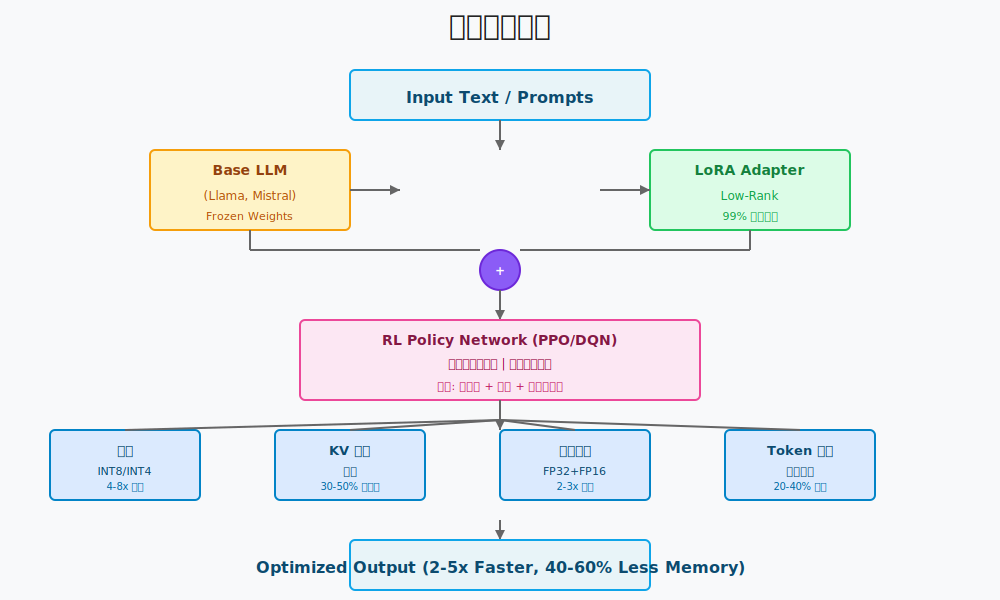
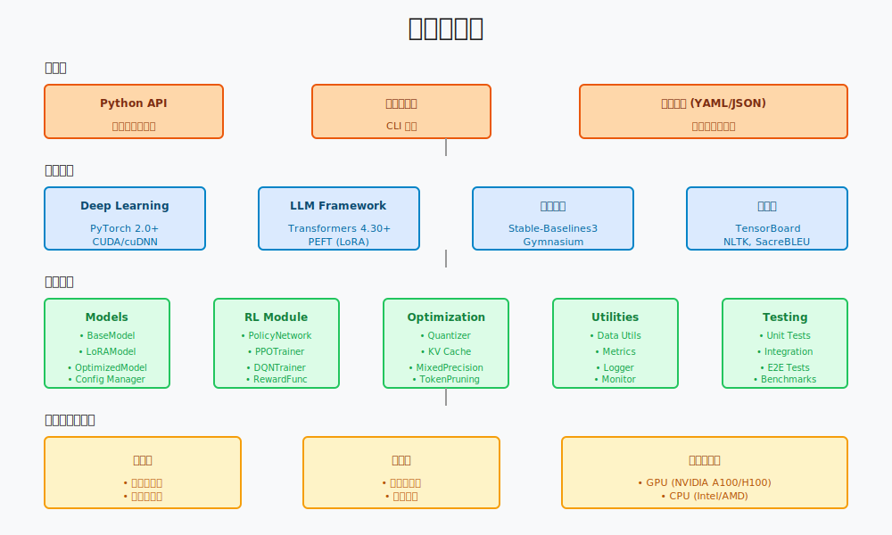
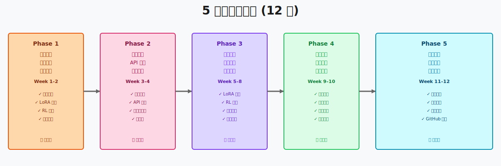
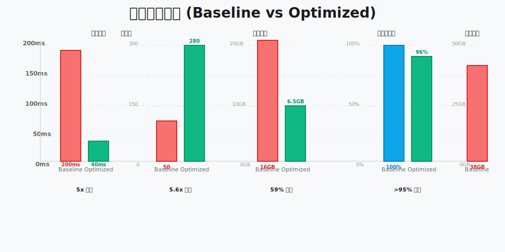

# 🚀 基於 LoRA 與強化學習之 LLM 推理優化

> **2026 深度強化學習期末專題**  
> 一個結合參數高效微調和強化學習的大型語言模型推理優化系統

[](https://github.com/Charles8745/2026DRLFinalProject)
[]()
[]()
[]()

---

## � 項目概述

### 問題陳述
大型語言模型 (LLM) 在生成任務中表現出色，但其推理過程計算量大、延遲高、顯存占用多。這限制了 LLM 在實時應用和邊緣設備上的部署。

### 核心創新
本專題結合以下技術：
- **LoRA (Low-Rank Adaptation)**: 實現參數高效的模型微調
- **強化學習 (PPO/DQN)**: 優化推理過程和資源分配
- **多維度優化**: 量化、KV 緩存、混合精度推理

### 預期成果
| 指標 | 目標 |
|------|------|
| 推理加速 | **2-5 倍** 速度提升 |
| 記憶體節省 | **40-60%** 顯存降低 |
| 精度保留 | **>95%** 準確度保持 |

---

## ✨ 主要特性

### 🎯 核心功能
- ✅ **LoRA 集成**: 低秩適應實現高效微調，減少 99% 的可訓練參數
- ✅ **強化學習優化**: PPO/DQN 算法優化推理策略和資源分配
- ✅ **多優化技術**: 量化、KV 緩存、混合精度推理
- ✅ **完整評估框架**: BLEU、ROUGE、Perplexity 等多維度評估
- ✅ **性能監控**: 實時性能監控和可視化
- ✅ **易用 API**: 簡潔的 Python API，開箱即用

### 🔧 技術支持
- 🐍 **Python 3.10+**
- 🔥 **PyTorch 2.0+**
- 🤗 **Hugging Face Transformers**
- 🎯 **PEFT (Parameter-Efficient Fine-Tuning)**
- 🎮 **Stable-Baselines3** (強化學習)

---

## 🏗️ 系統架構

### 系統架構圖



系統採用多層設計，從輸入文本到優化輸出的完整流程：
- **Base LLM**: 凍結的基礎模型
- **LoRA 適配層**: 參數高效的微調層
- **RL 策略網絡**: 優化推理策略的決策模塊
- **優化技術**: 量化、KV 緩存、混合精度

---

## �️ 項目結構

```
2026DRLFinalProject/
│
├── 📄 README.md                          # 本文件
├── 📄 OPENSPEC.md                        # 開發計劃 (12 週)
├── 📄 requirements.txt                   # 依賴庫
│
├── 📊 文檔與演示
│   ├── FinalProject_ppt.pdf              # PPT 演示
│   ├── related_work.pdf                  # 相關文獻
│   └── 系統設計規格書.pdf                # 設計規格
│
├── 📁 openspec/                          # OpenSpec 規範
│   ├── config.yaml                       # 配置規範
│   └── specs/
│       ├── project_specification.md      # 項目規範
│       └── architecture_spec.md          # 架構規範
│
├── 📁 src/                               # 源代碼
│   ├── models/                           # 模型定義
│   │   ├── base_model.py
│   │   ├── lora_model.py
│   │   └── optimized_model.py
│   │
│   ├── rl/                               # 強化學習
│   │   ├── policy.py
│   │   ├── value_net.py
│   │   ├── ppo_trainer.py
│   │   └── dqn_trainer.py
│   │
│   ├── optimization/                     # 優化模塊
│   │   ├── quantizer.py
│   │   ├── kv_cache.py
│   │   └── mixed_precision.py
│   │
│   └── utils/                            # 工具函數
│       ├── data_utils.py
│       ├── metrics.py
│       ├── logger.py
│       └── monitor.py
│
├── 📁 data/                              # 數據目錄
│   ├── raw/                              # 原始數據
│   ├── processed/                        # 處理後數據
│   └── splits/                           # 數據分割
│
├── 📁 experiments/                       # 實驗結果
│   ├── checkpoints/                      # 模型檢查點
│   ├── logs/                             # 訓練日誌
│   └── results/                          # 評估結果
│
├── 📁 tests/                             # 測試代碼
│   ├── test_models.py
│   ├── test_rl.py
│   └── test_optimization.py
│
├── 📁 notebooks/                         # Jupyter 筆記本
│   ├── 01_eda.ipynb
│   ├── 02_baseline.ipynb
│   └── 03_analysis.ipynb
│
├── 📁 configs/                           # 配置文件
│   └── default.yaml
│
└── .gitignore
```

---

## 🚀 快速開始

### 1️⃣ 環境設置

#### 克隆倉庫
```bash
git clone https://github.com/Charles8745/2026DRLFinalProject.git
cd 2026DRLFinalProject
```

#### 創建虛擬環境
```bash
# 使用 Python venv
python3 -m venv venv
source venv/bin/activate  # macOS/Linux
# 或
venv\Scripts\activate  # Windows
```

#### 安裝依賴
```bash
pip install -r requirements.txt
```

#### 驗證安裝
```bash
python -c "import torch; print(f'PyTorch {torch.__version__}')"
python -c "import transformers; print(f'Transformers {transformers.__version__}')"
```

### 2️⃣ 了解項目

#### 查看項目文檔
```bash
# 查看完整開發計劃
cat OPENSPEC.md

# 查看 PPT 演示
open FinalProject_ppt.pdf  # macOS
# 或使用其他 PDF 閱讀器打開
```

#### 瀏覽文檔
| 文件 | 說明 |
|------|------|
| `FinalProject_ppt.pdf` | 項目完整演示和技術方案 |
| `related_work.pdf` | 相關研究和技術背景 |
| `系統設計規格書.pdf` | 詳細系統設計規範 |
| `openspec/specs/project_specification.md` | 項目完整規範 |
| `openspec/specs/architecture_spec.md` | 架構詳細設計 |

### 3️⃣ 運行示例 (Coming Soon)

```bash
# 訓練模型
python src/train.py --config configs/default.yaml

# 評估模型
python src/evaluate.py --model_path experiments/checkpoints/best_model.pt

# 運行推理
python src/inference.py --text "Your prompt here"

# 運行性能基準測試
python src/benchmark.py --model_path experiments/checkpoints/best_model.pt
```

---

## � 詳細文檔

### 核心概念

#### LoRA (Low-Rank Adaptation)
LoRA 通過在原始模型旁邊添加小的可訓練矩陣（秩為 r），實現高效微調：

```
Original Weight: W ∈ ℝ^(d_out × d_in)
LoRA Update:    ΔW = B A^T  where A ∈ ℝ^(d_in × r), B ∈ ℝ^(d_out × r)
Training Parameters: r × (d_in + d_out)  << d_in × d_out
```

**優勢**:
- 🎯 參數減少 99%
- ⚡ 訓練速度提升
- 💾 顯存占用降低

#### 強化學習優化
使用 PPO (Proximal Policy Optimization) 優化推理過程：

```
Goal: Maximize Reward = Quality - λ × (Latency + Memory)
Policy: π(action|state) → 決策 token pruning、量化策略等
```

#### 多維度優化
- **量化**: INT8/INT4 量化減少模型大小 4-8 倍
- **KV 緩存**: 優化注意力機制的緩存
- **混合精度**: FP32 + FP16 混合推理

## 🛠️ 技術棧架構



### 技術棧詳解

```yaml
Deep Learning Framework:
  PyTorch >= 2.0.0          # 核心深度學習框架
  Transformers >= 4.30.0    # Hugging Face Transformers
  PEFT >= 0.4.0             # LoRA 實現

Reinforcement Learning:
  Stable-Baselines3 >= 2.0.0  # RL 算法實現
  Gymnasium >= 0.28.0         # RL 環境

Evaluation & Monitoring:
  SacreBLEU                   # 機器翻譯評估
  NLTK, ROUGE                 # 文本評估
  scikit-learn                # 機器學習工具
  TensorBoard                 # 訓練監控
  Weights & Biases            # 實驗跟蹤

Development Tools:
  pytest >= 7.4.0             # 單元測試
  black >= 23.0.0             # 代碼格式化
  flake8 >= 6.0.0             # 代碼檢查
  isort >= 5.12.0             # Import 排序
```

### 完整技術棧表格

| 層級 | 框架/工具 | 版本 | 說明 |
|------|-----------|------|------|
| **深度學習** | PyTorch | >= 2.0.0 | 核心計算框架 |
| **NLP** | Transformers | >= 4.30.0 | LLM 和分詞 |
| **LoRA** | PEFT | >= 0.4.0 | 參數高效微調 |
| **強化學習** | Stable-Baselines3 | >= 2.0.0 | RL 算法實現 |
| **環境** | Gymnasium | >= 0.28.0 | RL 環境接口 |
| **評估** | SacreBLEU | >= 2.3.0 | 機器翻譯評估 |
| **評估** | NLTK | >= 3.8.0 | NLP 評估工具 |
| **監控** | TensorBoard | >= 2.13.0 | 訓練監控 |
| **測試** | pytest | >= 7.4.0 | 單元測試 |
| **代碼質量** | black | >= 23.0.0 | 代碼格式化 |

---

## 🎯 開發進度

### 5 階段開發計劃 (12 週)



| 階段 | 時間 | 任務 | 狀態 |
|------|------|------|------|
| **Phase 1** | Week 1-2 | 環境設置、文獻研究、原型驗證 | 📋 計劃中 |
| **Phase 2** | Week 3-4 | 架構設計、API 規範、數據管道 | 📋 計劃中 |
| **Phase 3** | Week 5-8 | 核心實現、單元測試、集成測試 | 📋 計劃中 |
| **Phase 4** | Week 9-10 | 模型訓練、參數優化、性能調優 | 📋 計劃中 |
| **Phase 5** | Week 11-12 | 評估驗證、文檔完善、開源發布 | 📋 計劃中 |

**詳細計劃**: 查看 [OPENSPEC.md](./OPENSPEC.md)

---

## 📊 評估指標

### 性能對比



### 詳細指標

#### 準確度指標
- **BLEU Score**: 機器翻譯質量 (目標 >0.30)
- **ROUGE Score**: 文本摘要質量 (目標 >0.40)
- **Perplexity**: 語言建模困惑度 (目標 <50)
- **F1 Score**: 分類任務準確率 (目標 >0.75)

#### 性能指標
- **推理延遲**: <50ms (目標)
- **吞吐量**: >200 req/s (目標)
- **峰值記憶體**: <8GB (目標)
- **能耗**: <150W (目標)

#### 優化指標
- **加速比**: >3x (目標)
- **記憶體節省**: >50% (目標)
- **精度保留**: >95% (目標)

---

## 🛠️ API 使用示例

### 加載模型
```python
from src.models import LoRAModel

# 初始化 LoRA 模型
model = LoRAModel(
    base_model='llama-2-7b',
    lora_rank=8,
    lora_alpha=16
)
```

### 訓練模型
```python
from src.rl import PPOTrainer

trainer = PPOTrainer(
    model=model,
    learning_rate=1e-4,
    device='cuda'
)

trainer.train(
    train_dataloader=train_loader,
    num_epochs=10
)
```

### 推理
```python
from src.utils import InferenceEngine

engine = InferenceEngine(
    model=model,
    quantize=True,
    bits=8,
    enable_kv_cache=True
)

response = engine.generate(
    prompt='Hello world',
    max_length=100
)
```

---

## � 推薦閱讀

### 核心論文
- [LoRA: Low-Rank Adaptation of Large Language Models](https://arxiv.org/abs/2106.09685)
- [Proximal Policy Optimization Algorithms](https://arxiv.org/abs/1707.06347)
- [Attention Is All You Need](https://arxiv.org/abs/1706.03762)

### 相關資源
- [Hugging Face Transformers 文檔](https://huggingface.co/transformers/)
- [PEFT GitHub](https://github.com/huggingface/peft)
- [Stable-Baselines3 文檔](https://stable-baselines3.readthedocs.io/)

---

## 🤝 貢獻指南

### 報告 Issue
發現問題？請提交 Issue，包含：
- 問題描述
- 復現步驟
- 預期結果
- 實際結果

### 提交 Pull Request
歡迎提交 PR：
1. Fork 倉庫
2. 創建特性分支 (`git checkout -b feature/amazing-feature`)
3. 提交更改 (`git commit -m 'feat: Add amazing feature'`)
4. Push 到分支 (`git push origin feature/amazing-feature`)
5. 開啟 Pull Request

### 提交規範
遵循 [Conventional Commits](https://www.conventionalcommits.org/zh-hans/):
```
feat:    新功能
fix:     bug 修複
docs:    文檔更新
refactor: 代碼重構
test:    測試代碼
perf:    性能優化
chore:   工具/配置
```

---

## 📄 許可證

本項目採用 **MIT 許可證**。詳見 [LICENSE](./LICENSE) 文件。

---

## 🙋 聯絡方式

- **GitHub**: [@Charles8745](https://github.com/Charles8745)
- **Email**: [your-email@example.com]
- **Issues**: [GitHub Issues](https://github.com/Charles8745/2026DRLFinalProject/issues)

---

## 🎓 致謝

感謝以下項目和社區的支持：
- Hugging Face Transformers
- PEFT 團隊
- Stable-Baselines3 開發者
- 開源社區

---

## 📈 相關項目與工作

### 本項目相關文檔
| 文檔 | 描述 |
|------|------|
| [OPENSPEC.md](./OPENSPEC.md) | 詳細開發計劃和里程碑 |
| [openspec/specs/project_specification.md](./openspec/specs/project_specification.md) | 完整項目規範 |
| [openspec/specs/architecture_spec.md](./openspec/specs/architecture_spec.md) | 系統架構規範 |
| [FinalProject_ppt.pdf](./FinalProject_ppt.pdf) | PPT 演示 |
| [related_work.pdf](./related_work.pdf) | 相關文獻 |
| [系統設計規格書.pdf](./系統設計規格書.pdf) | 設計規格 |

---

<div align="center">

**⭐ 如果這個項目對你有幫助，請給我們一個 Star！**

Made with ❤️ by Charles | 2026

</div>

---

**最後更新**: 2026-04-22  
**下次更新**: 完成 Phase 1 後
